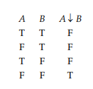
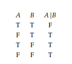

# Chapter 1.3: Adequate Sets of Connectives

"Every statement form containing *n* statement letters generates a corresponding truth function of *n* arguments... 
Logically equivalent forms generate the same truth function." Page 19

# Proposition 1.5: Page 19

Every truth function is generated by some statement form involving the propositional connectives ¬, ∧ and ∨.

# Corollary 1.6: Page 21

Every truth function can be generated by a statement form containing either:

∧ and ¬, **OR**

∨ and ¬, **OR**

⇒ and ¬

Joint denial: Operation represented by (↓). Page 21

Joint denial truth table: Page 21

Alternative denial: Operation represented by (|)

Alternative denial truth table: Page 22

# Proposition 1.7: Page 22

The only binary propositional connectives that, alone, are adequate for creating every truth function, are joint denial and
alternative denial.

Literal: Statement letter or negation of a statement letter. Page 23

Disjunctive normal form (dnf): A disjunction of >= 1 disjuncts, where each disjunct is a conjunction of >= 1 
literals. Page 23

Conjunctive normal form (cnf): A conjunction of >= 1 conjuncts, where each conjunct is a disjunction of >= 1
literals. Page 23.

Full cnf/dnf: A cnf or dnf is full if no conjunct/disjunct contains two literals with the same letter, AND
if a letter that occurs in one conjunct/disjunct also occurs in all others. Page 24

Satisfiable (adj.): A statement form is satisfiable if it is true for some assignment of truth values to its statement 
letters. Page 24

Blatant contradiction (noun): A cnf that contains some statement letter and that statement letter's negation as conjuncts.

