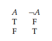

# Chapter 1.1: Propositional Connectives: Truth Tables

Truth-functional (adj.): "Combinations in which the truth or falsity of the new sentence is determined by 
the truth or falsity of its component sentences." - Page 1

Negation: Operation represented by (¬). Changes a **True** to **False** and a **False** to **True**. Page 1

Truth table: A table showing, for each combination of **True** or **False** given to the sentences, gives the output
of the operation performed on them. Page 1

Negation truth table: 

 Page 1

Truth values: **True** or **False** in reference to the evaluation of an operation or the value given to a sentence. Note: 
From here on, **T** = **True** and **F** = **False**. Page 1

Conjunction: Operation represented by (∧). Page 1

Conjunction truth table: 

 Page 1

Conjuncts: Two or more sentences linked together by ∧. Page 1

Disjunction: Operation represented by (∨). Page 2

Disjunction truth table:

 Page 2

Disjuncts: Two or more sentences linked together by ∨. Page 2

Conditional: Operation represented by (⇒). May be read as "If A, then B," for sentences A and B. Page 2

Antecedent: Sentence on the left side of ⇒.

Consequent: Sentence on the right side of ⇒.

Conditional truth table:

 Page 2

Biconditional: Operation represented by (⇔). May be read as "A if and only if B," for sentences A and B. Page 3

Biconditional truth table:

 Page 3

Propositional connectives: ¬, ∧, ∨, ⇒, ⇔. "Any sentence built up by application of these connectives has a truth value that
depends on the truth values of the constituent sentences." Page 3

Statement letters: Letters that represent sentences and may take **T** or **F** as truth values. Page 3

Statement form: Expression built from statement letters and valid applications of propositional connectives. Page 3-4
    
    1. All statement letters (capital italic letters) and statement letters with numerical subscripts are statement forms.

    2. If *B* and *C* are statement forms, so are ¬*B*, (*B*∧*C*), (*B*∨*C*), (*B*⇒*C*) and (*B*⇔*C*).

    3. Only the expression determined by the above 1. and 2. are statement forms.

Truth function: "For every assignment of truth values T or F to the statement letters that occur
in a statement form, there corresponds, by virtue of the truth tables for the
propositional connectives, a truth value for the statement form." May be represented accurately as a truth table. Page 4

For *n* distinct letters in a statement form, there are 2^*n* possible assignments of truth values and 2^*n* rows in the
truth table. Page 4

Principal connective: Propositional connective "applied last in constructing the form." Page 5

Atomic sentences: Sentences not composed of other sentences. Page 5

